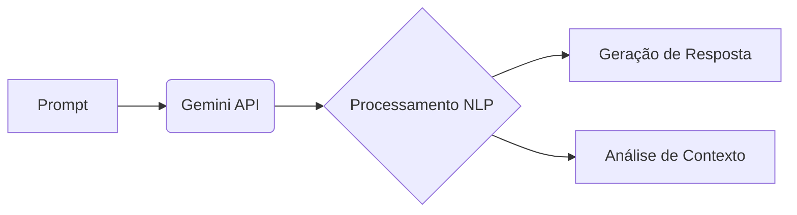

# 🚀 Aula 01 - **Mergulhando no Gemini, a IA do Google** 🤖

Bem-vindo(a) à primeira aula da jornada de exploração do **Google Gemini**! Aqui, você encontrará um resumo dos tópicos abordados, conceitos aprendidos e os primeiros passos nesta incrível ferramenta de IA.

---

## 📌 **Visão Geral**  
Nesta aula, mergulhamos no universo da Inteligência Artificial do Google, o **Gemini**, explorando sua plataforma, funcionalidades e interações iniciais. Além disso, refletimos sobre conceitos fundamentais de IA com base nas respostas geradas pela LLM (*Large Language Model*).

---

## 🎮 **Tópicos Abordados**  

### 1. **Apresentando a plataforma do Gemini e suas configurações**  
- 🌐 Introdução à interface do Gemini e sua integração com ecossistemas Google.  
- ⚙️ Configurações iniciais: personalização de preferências e ajustes de segurança.  
- 🔍 Exploração de recursos disponíveis (ex: geração de texto, respostas contextualizadas).  

### 2. **Primeiras interações com o Google Gemini**  
- 💬 "Conversando" com a IA: comandos básicos e perguntas simples.  
- 🧩 Testando funcionalidades: exemplos de prompts e análise das respostas.  
- 📝 Dicas para formular perguntas eficientes e obter resultados mais precisos.

  ---

## 🧠 **Conceitos-Chave**  
### Arquitetura do Gemini - *Fluxo básico de interação com o Gemini*

### 3. **Conceitos iniciais sobre "O que é IA?"**  
- 🤔 Discussão guiada pela LLM: definições de **Inteligência Artificial**, **Machine Learning** e **LLMs**.  
- 🌟 Entendendo como modelos como o Gemini processam informações e geram respostas.  
- ⚠️ Limitações e ética no uso de IA: reflexões trazidas pela própria Gemini durante a interação.  

### 4. **Primeira interação com o Google AI Studio**  
- 🛠️ Introdução ao **Google AI Studio**: ambiente de desenvolvimento para criar e testar modelos de IA.  
- 🧪 Prototipagem rápida: como criar um projeto simples usando a interface intuitiva.  
- 🔄 Comparação entre Gemini e AI Studio: diferenças de uso e objetivos de cada ferramenta.  
- 📊 Testes práticos: explorando a geração de conteúdo, ajuste de parâmetros e visualização de resultados.  

---

## 📚 **Pré-requisitos**  
- ✅ Acesso à plataforma Google Gemini e ao Google AI Studio (contas Google configuradas).  
- ✅ Navegador atualizado e conexão estável com a internet.  
- ✅ Curiosidade para experimentar e explorar! 🔍  

---

## 🔜 **Próximos Passos**  
Na próxima aula, vamos:  
- Aprofundar em **prompts avançados** e técnicas de otimização.  
- Explorar casos de uso práticos do Gemini e AI Studio em projetos reais.  
- Discutir **boas práticas** para integrar IA no dia a dia.  

---

> 🌟 *"A IA não substitui a inteligência humana, mas amplifica nossa capacidade de resolver problemas."* — Reflexão gerada pelo Gemini durante a aula.
